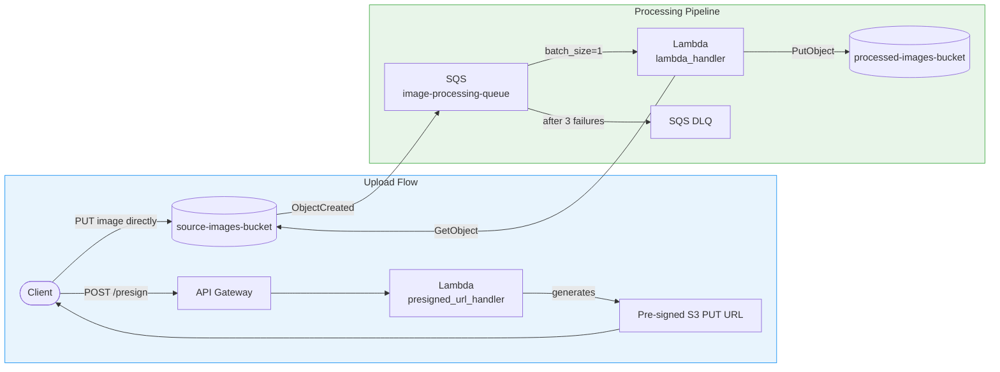

# Daisy Image Processor

[](https://github.com/VarangianLabs/daisy-image-processor/actions/workflows/ci.yml)
[](LICENSE)
[](https://www.python.org/downloads/)
[](https://developer.hashicorp.com/terraform)

A production-grade, **serverless image processing pipeline** on AWS. Upload a raw image to S3; it is automatically resized, watermarked, and stored in a processed bucket — all without managing any servers.

> **Built to demonstrate:** Event-driven architecture · AWS Lambda · S3 · SQS · Terraform IaC · Python 3.12 · Test-driven development · Security-first IAM design

---

## What it does

```
Client ──► Pre-signed URL API ──► S3 direct upload
                                        │
                              S3 ObjectCreated event
                                        │
                                       SQS queue
                                        │
                                   Lambda function
                                  (resize + watermark)
                                        │
                               processed-images-bucket
                                        │
                              ◄── CDN / downstream app
```

| Input | Output |
|-------|--------|
| Any JPEG, PNG, or WebP image | Resized JPEG ≤ 1280×1280 px, watermarked, quality 85 |
| Raw bytes up to 20 MB | Compressed output (typically 40–60% smaller) |
| S3 direct upload (no API Gateway payload limit) | Stored at `processed/<original-key>` |

---

## Architecture



**Key design decisions:**

| Decision | Rationale |
|----------|-----------|
| Pre-signed URLs for upload | Bypasses API Gateway's 10 MB payload ceiling |
| SQS between S3 and Lambda | Decouples ingestion burst from processing; enables DLQ retry |
| `batch_size = 1` | Prevents one corrupt image from blocking others in the batch |
| `image_processor.py` has zero AWS imports | Pure Python — fully testable without any AWS context |
| Vendor dependencies bundled in zip | No Lambda layer dependency; portable across accounts |

---

## Features

- **Resize** — thumbnails to a configurable max bounding box (default 1280×1280), LANCZOS resampling
- **Watermark** — semi-transparent text overlay, bottom-right corner, 50% opacity
- **JPEG re-encode** — quality 85, progressive optimization
- **Security guardrails** — PIL DecompressionBomb cap (50 MP), 20 MB hard ceiling, extension allowlist
- **IAM least-privilege** — `GetObject` on source only, `PutObject` on processed only, no cross-bucket writes
- **DLQ routing** — failed records retry 3× then land in a 14-day dead-letter queue
- **Zero-downtime deploys** — Terraform idempotent; Lambda `source_code_hash` triggers update only on code change

---

## Prerequisites

| Tool | Version | Required for |
|------|---------|-------------|
| Python | 3.12 | Application + tests |
| Docker | 24.0+ | LocalStack local development |
| AWS CLI | 2.x | Bucket/queue management |
| Terraform | 1.5+ | Production deployment only |
| zip | any | Lambda package build |

---

## Quick Start — Local (5 minutes)

**1. Clone and configure**

```bash
git clone https://github.com/VarangianLabs/daisy-image-processor.git
cd daisy-image-processor
cp .env.example .env       # review the values; defaults work for LocalStack
```

**2. Start LocalStack**

```bash
make local-up              # starts daisy-localstack container on :4566
```

**3. Build the Lambda package**

```bash
make vendor                # downloads manylinux2014_x86_64 packages → vendor/
make build                 # packages src/ + vendor/ → terraform/lambda.zip
```

**4. Deploy all infrastructure to LocalStack**

```bash
make deploy-local          # idempotent; auto-detects Docker bridge IP
```

Output confirms each resource created:
```
  ✓  Role daisy-lambda-role-local already exists
  ✓  Created main queue: image-processing-queue
  ✓  Created Lambda function: daisy-image-processor
  ✓  S3 → SQS notification configured on source-images-bucket
```

**5. Upload a test image and watch the pipeline run**

```bash
# Upload any JPEG to the source bucket
AWS_ACCESS_KEY_ID=test AWS_SECRET_ACCESS_KEY=test \
  aws --endpoint-url=http://localhost:4566 \
  s3 cp /path/to/photo.jpg s3://source-images-bucket/test/photo.jpg

# A few seconds later, the processed output appears:
AWS_ACCESS_KEY_ID=test AWS_SECRET_ACCESS_KEY=test \
  aws --endpoint-url=http://localhost:4566 \
  s3 ls s3://processed-images-bucket --recursive
# → processed/test/photo.jpg
```

**6. Run the test suite**

```bash
make test                  # 137 unit + integration tests, no AWS required
make chaos                 # 10 adversarial chaos scenarios
```

---

## Production Deployment (AWS)

> Requires an AWS account, Terraform 1.5+, and a pre-existing S3 bucket for Terraform remote state.

**1. Create the Terraform state backend** *(one-time setup)*

```bash
aws s3api create-bucket --bucket my-tfstate-store --region us-east-1
aws s3api put-bucket-versioning \
  --bucket my-tfstate-store \
  --versioning-configuration Status=Enabled

aws dynamodb create-table \
  --table-name my-tfstate-lock \
  --attribute-definitions AttributeName=LockID,AttributeType=S \
  --key-schema AttributeName=LockID,KeyType=HASH \
  --billing-mode PAY_PER_REQUEST
```

Update `terraform/providers.tf` with your bucket and table names.

**2. Build and deploy**

```bash
make build                             # build lambda.zip

terraform -chdir=terraform init
terraform -chdir=terraform apply \
  -var="source_bucket_name=my-source-images" \
  -var="processed_bucket_name=my-processed-images" \
  -var="sqs_queue_name=my-image-queue" \
  -var="environment=production"
```

**3. Verify outputs**

```bash
terraform -chdir=terraform output
```

---

## Configuration Reference

All runtime settings are injected as Lambda environment variables.

| Variable | Required | Default | Description |
|----------|----------|---------|-------------|
| `SOURCE_BUCKET` | ✅ | — | S3 bucket for incoming raw images |
| `PROCESSED_BUCKET` | ✅ | — | S3 bucket for processed output (must differ from source) |
| `SQS_QUEUE_URL` | ✅ | — | URL of the SQS processing queue |
| `AWS_ENDPOINT_URL` | Local only | `""` | LocalStack endpoint — auto-set by `deploy_local.py` |
| `AWS_REGION` | ❌ | `us-east-1` | AWS region |

Image processing constants (edit `src/image_processor.py`):

| Constant | Default | Description |
|----------|---------|-------------|
| `MAX_OUTPUT_WIDTH` | `1280` | Maximum output image width in pixels |
| `MAX_OUTPUT_HEIGHT` | `1280` | Maximum output image height in pixels |
| `WATERMARK_TEXT` | `"© Daisy"` | Watermark string |
| `WATERMARK_OPACITY` | `128` | Watermark opacity (0–255) |
| `OUTPUT_QUALITY` | `85` | JPEG output quality |

---

## Cost Projection

Running at **1 million images/month** on AWS (us-east-1, 512 MB Lambda, ~0.5s/image):

| Service | Usage | Monthly Cost |
|---------|-------|-------------|
| Lambda | 1M invocations × 0.5s × 512 MB | ~$4.20 |
| S3 (source) | 1M PUT + 1M GET requests | ~$0.80 |
| S3 (processed) | 1M PUT requests + 10 GB storage | ~$1.03 |
| SQS | 1M messages (free tier covers first 1M) | ~$0.00–$0.40 |
| CloudWatch Logs | 1 GB ingestion | ~$0.50 |
| **Total** | | **~$6.50–$7.00/month** |

*Compare: Cloudinary's equivalent tier starts at $99/month.*

---

## Running Tests

```bash
# Unit + integration tests (no Docker, no AWS)
make test

# Chaos / adversarial stress suite
make chaos

# Live end-to-end test against LocalStack (requires make local-up + make deploy-local)
PYTHONPATH=vendor python3 scripts/integration_test.py

# Dependency security audit
pip install pip-audit && pip-audit -r src/requirements.txt
```

---

## Project Layout

```
daisy-image-processor/
├── src/
│   ├── handler.py            # Lambda entry point — AWS boundary only
│   ├── image_processor.py    # Pure Python image transforms (zero AWS imports)
│   └── config.py             # Environment variable binding
├── tests/
│   ├── unit/                 # Fast offline tests (mock boto3)
│   └── integration/          # Pipeline integration tests
├── terraform/                # All infrastructure-as-code
│   ├── main.tf               # IAM, S3, SQS, Lambda, event source mapping
│   ├── variables.tf          # Input variables
│   ├── outputs.tf            # Stack outputs (bucket names, queue URL, Lambda ARN)
│   └── local.tfvars          # LocalStack development values
├── scripts/
│   ├── build_vendor.sh       # Download Lambda runtime dependencies
│   ├── deploy_local.py       # Fast LocalStack deployment (replaces terraform apply)
│   └── integration_test.py   # Live E2E test runner
├── docker-compose.yml        # LocalStack service definition
├── Makefile                  # All developer commands
├── CHANGELOG.md
└── LICENSE
```

---

## Contributing

Contributions are welcome. Please read [CONTRIBUTING.md](CONTRIBUTING.md) before opening a pull request.

**Quick checklist:**
- `make test` passes
- `make lint` clean
- If `src/requirements.txt` changed: run `make vendor` and commit updated vendor lock
- No `terraform.tfstate`, `lambda.zip`, or `.env` files in the PR

---

## License

[MIT](LICENSE) — Prince Ngcobo, 2026
