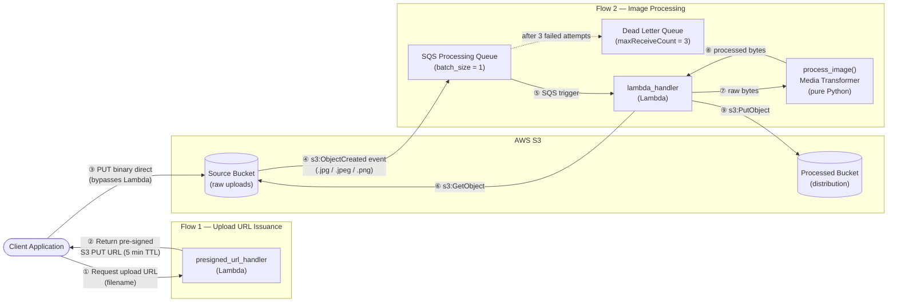

# Architecture Reference
## Daisy Image Processor — System Design and Operational Contracts

> **Version:** 1.0.0  
> **Audience:** Engineers, security reviewers, and contributors  
> **Last updated:** 2026-07-13

---

## 1. System Overview

Daisy Image Processor is a serverless event-driven pipeline that accepts raw image uploads from client applications, transforms them (resize + watermark), and stores the processed output in a separate S3 bucket for distribution. The pipeline is designed for cost efficiency at low-to-medium volume, with zero idle compute cost and automatic retry semantics via SQS.

**Runtime:** Python 3.12 on AWS Lambda (x86_64)  
**Infrastructure:** Terraform-managed, deployable to AWS or locally via LocalStack

---

## 2. Data Flow

The system operates across two independent flows that never directly interact with each other.

### Full Pipeline Diagram

### Flow 1 — Upload URL Issuance

The client requests a pre-signed S3 PUT URL from `presigned_url_handler`. The Lambda generates a time-limited URL (5 minutes) and returns it. The client uploads the binary image file directly to the Source Bucket using that URL — the image bytes never pass through Lambda or API Gateway. This is the mechanism that prevents the 10 MB API Gateway payload ceiling from becoming a constraint.

### Flow 2 — Image Processing

When an object lands in the Source Bucket, S3 emits an `ObjectCreated` event to the SQS Processing Queue. The Lambda is triggered with `batch_size = 1` (one message per invocation). The handler downloads the raw image from S3, delegates all transformation to `process_image()` in `image_processor.py`, and writes the result to the Processed Bucket. If a message fails three times, it is moved to the Dead Letter Queue for manual review.

---

## 3. Architectural Guardrails

These are hard constraints, not preferences. Violating any one of them breaks a specific failure mode protection.

### Guardrail 1 — No Base64 Image Ingestion Through API Gateway

**The constraint:** Images must never be uploaded as base64-encoded strings through API Gateway or any Lambda event payload.

**The failure mode it prevents:** API Gateway has a 10 MB maximum payload limit (6 MB for synchronous Lambda invocations). A typical raw image easily exceeds this limit. Base64 encoding inflates binary data by ~33%, making the problem worse. Any system that routes image bytes through an HTTP API layer has a hard ceiling that cannot be engineered around without pre-signed URLs.

**How it is enforced:** `presigned_url_handler` generates an S3 pre-signed URL. The client receives the URL and uploads directly to S3 using a standard HTTP PUT. Lambda and API Gateway see only the small JSON request for the URL — never the image bytes.

---

### Guardrail 2 — Lambda Never Writes to the Source Bucket

**The constraint:** `lambda_handler` may only call `s3:GetObject` on the Source Bucket. It must never call `s3:PutObject` on the Source Bucket under any circumstances.

**The failure mode it prevents:** If the processing Lambda wrote its output back to the Source Bucket, the new object would trigger a new `ObjectCreated` S3 event. That event would enqueue a new SQS message. The Lambda would process the output image, write it back, trigger another event — creating an infinite invocation loop that runs until manually interrupted, producing thousands of Lambda invocations and unbounded S3 storage charges per original upload.

**How it is enforced in two independent layers:**

| Layer | Mechanism |
|---|---|
| IAM policy | `WriteProcessedBucketOnly` statement explicitly grants `s3:PutObject` only on `arn:aws:s3:::${processed_bucket_name}/*`. The Source Bucket ARN is absent from any `PutObject` statement. |
| Code | `s3_client.put_object(Bucket=config.processed_bucket, ...)` hardcodes the destination to `config.processed_bucket` (loaded from the `PROCESSED_BUCKET` environment variable). The Source Bucket is never used as a write destination. |

Both layers must remain intact. The IAM policy is the last-resort safety net if the code were ever modified incorrectly.

---

### Guardrail 3 — Processing Logic Is Decoupled From AWS Primitives

**The constraint:** `image_processor.py` must contain zero imports of `boto3`, `botocore`, or any AWS SDK module. All image transformation logic lives in this file and nowhere else.

**The failure mode it prevents:** Without this separation, image processing code cannot be unit-tested without a running AWS execution context. Tests would require either live AWS credentials, a running LocalStack container, or complex mock patching of AWS internals. The resulting test suite would be fragile, slow, and environment-dependent.

**How it is enforced:** `handler.py` is the only module that imports `boto3`. It downloads raw bytes from S3, passes them to `process_image(image_bytes)` as a plain `bytes` object, and receives processed bytes back. `image_processor.py` is a pure Python module that operates entirely on `bytes` and `PIL.Image` objects — both of which can be created in any test environment with no infrastructure dependency.

---

## 4. IAM Model

The Lambda execution role (`daisy-lambda-role-{environment}`) is provisioned with a single least-privilege policy. The table below documents the complete permission set and its rationale.

### What the Lambda CAN Do

| Permission | Resource | Why |
|---|---|---|
| `s3:GetObject` | `arn:aws:s3:::{source_bucket}/*` | Download uploaded images for processing |
| `s3:PutObject` | `arn:aws:s3:::{processed_bucket}/*` | Write processed output to the distribution bucket |
| `sqs:ReceiveMessage` | Processing Queue ARN | Poll for pending image processing jobs |
| `sqs:DeleteMessage` | Processing Queue ARN | Acknowledge successful processing, remove from queue |
| `sqs:GetQueueAttributes` | Processing Queue ARN | Required by the Lambda event source mapping |
| `logs:CreateLogGroup` | `/aws/lambda/daisy-image-processor` | Create the CloudWatch log group on first invocation |
| `logs:CreateLogStream` | `/aws/lambda/daisy-image-processor:*` | Create per-invocation log streams |
| `logs:PutLogEvents` | `/aws/lambda/daisy-image-processor:*` | Write structured log output |

### What the Lambda CANNOT Do

| Blocked Action | Why This Matters |
|---|---|
| `s3:PutObject` on the Source Bucket | Core infinite-loop guardrail (Guardrail 2) |
| `s3:DeleteObject` on any bucket | Lambda cannot destroy source material |
| `s3:GetObject` on the Processed Bucket | Lambda cannot read its own previous output |
| `sqs:SendMessage` | Lambda cannot inject new messages into the queue |
| `sqs:DeleteQueue` | Lambda cannot self-destruct its trigger |
| Any `iam:*` actions | Lambda cannot escalate its own privileges |
| Any `lambda:*` actions | Lambda cannot modify its own function or create new functions |

The complete HCL for this policy is in [`terraform/main.tf`](../terraform/main.tf) under `resource "aws_iam_policy" "lambda_policy"`.

---

## 5. Component Inventory

| Component | File | Role |
|---|---|---|
| Lambda handler | `src/handler.py` | AWS event boundary — SQS trigger and pre-signed URL issuance |
| Media transformer | `src/image_processor.py` | Pure Python image pipeline — resize, watermark, encode |
| Configuration loader | `src/config.py` | Environment variable binding with fail-fast validation |
| Infrastructure | `terraform/main.tf` | IAM, S3, SQS, Lambda, event source mapping |
| Provider config | `terraform/providers.tf` | AWS provider, remote state backend |
| Local emulation | `docker-compose.yml` | LocalStack container (S3, SQS, Lambda, IAM, logs) |

---

## 6. Key Design Decisions

**Why SQS between S3 and Lambda?**  
A direct S3-to-Lambda trigger fires one invocation per object upload synchronously with no buffering. Under a burst of concurrent uploads, this creates a spike of Lambda invocations that can exhaust concurrency limits and cause throttling. SQS absorbs the burst: messages accumulate in the queue and are consumed at a controlled rate. The DLQ ensures no message is silently lost if processing fails.

**Why `batch_size = 1`?**  
Image processing is CPU and memory intensive. A batch size greater than 1 would require multiple images to be decoded and held in memory simultaneously within the same invocation, risking OOM errors against the 512 MB Lambda ceiling. Processing one image per invocation keeps the memory footprint predictable.

**Why vendored dependencies in the Lambda package?**  
The Lambda Python 3.12 runtime includes the standard library only. `boto3` and `Pillow` must be bundled with the function code to be available at runtime. The current approach packages everything into a single zip; a Lambda Layer for the heavy dependencies is the next step to reduce function package size and cold start time.
